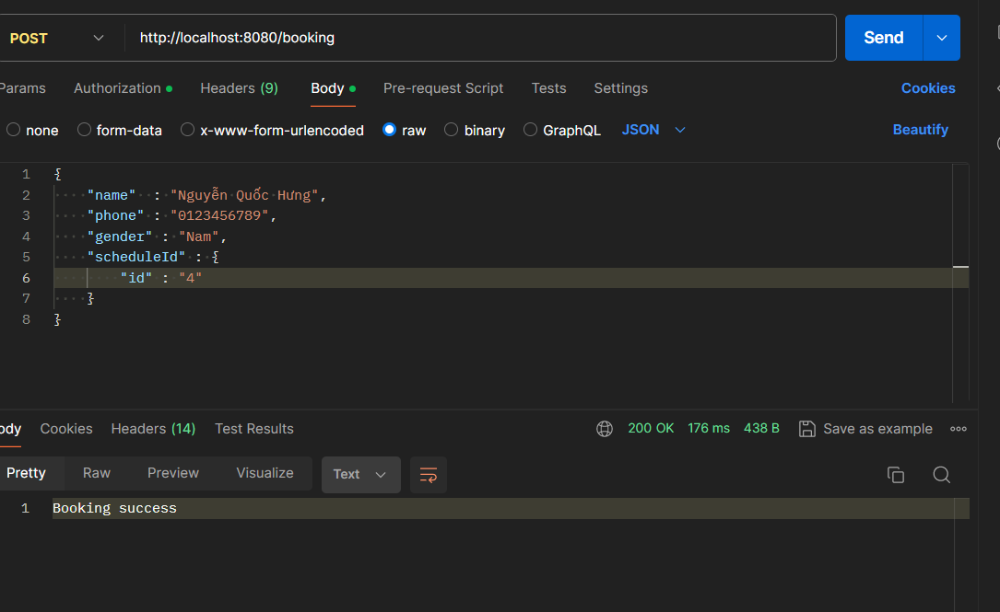
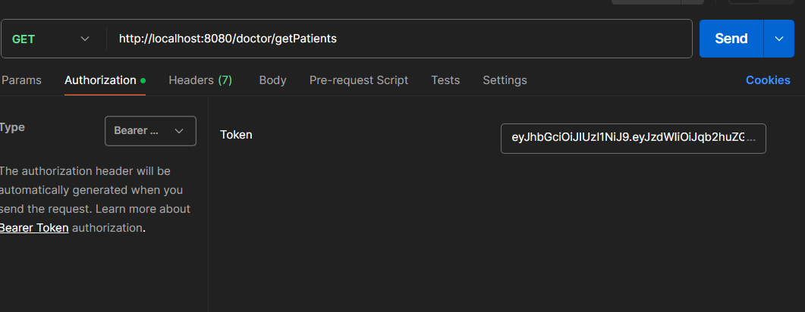
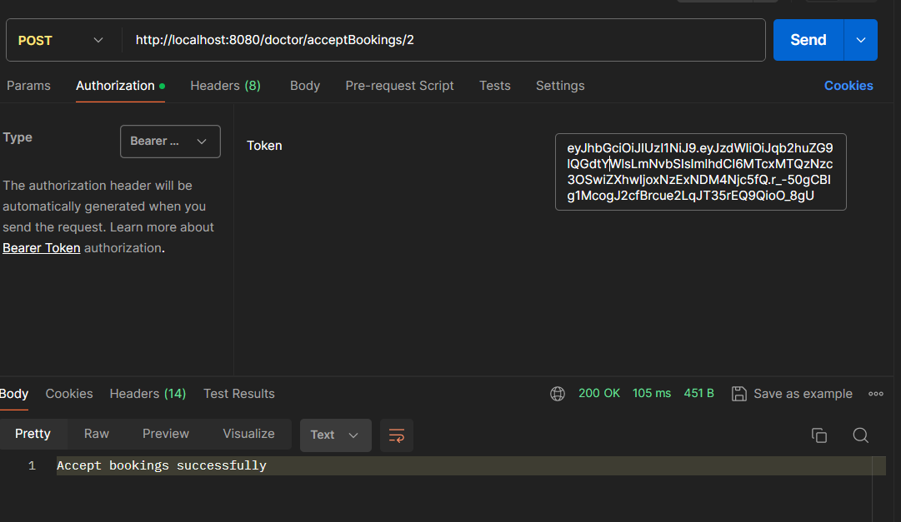
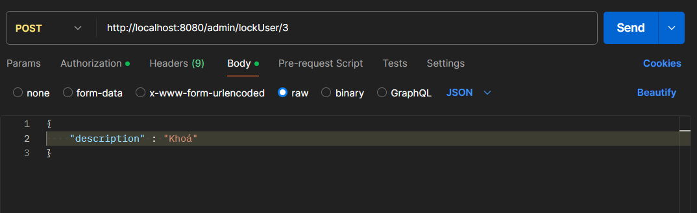
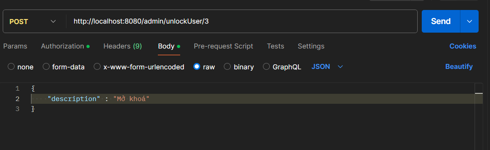
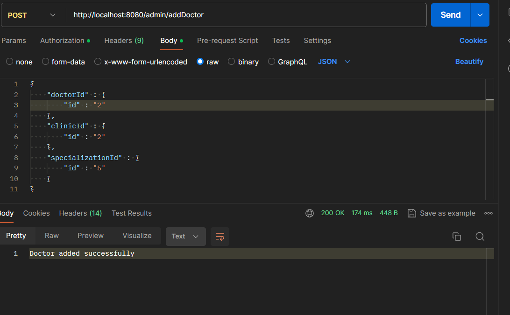
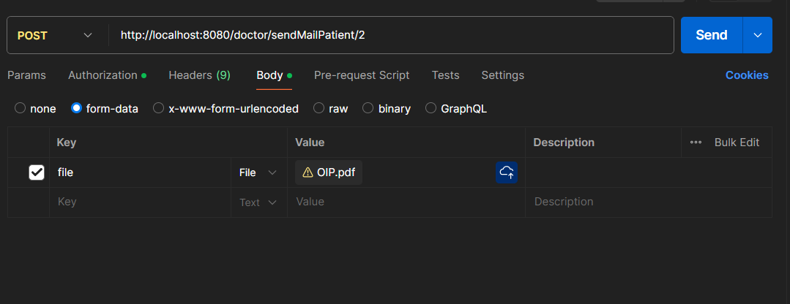

WEBSITE ĐẶT LỊCH KHÁM BỆNH CHỈ CÓ API

Được viết bằng ngôn ngữ Java, Spring Boot 3, Spring Security 6 JWT,  JDK 21

1. Chức năng đăng nhập, đăng ký

1.1 Đăng nhập

1.2 Đăng ký

1.3 Quên mật khẩu và đặt lại mật khẩu

Gửi mail xác thực

Nhận mail xác thực

Đặt lại mật khẩu

2. Yêu cầu dành cho người dùng

2.1 Hiển thị thông tin của các chuyên khoa nổi bật

2.2 Hiển thị thông tin của các cơ sở y tế nổi bật

2.3 Hiển thị thông tin cá nhân

Sau khi đăng nhập thành công xong, chúng ta có thể truy cập từ trang chủ để hiển thị ra những thông tin cá nhân của bản thân 

2.4 Tìm kiếm chung

Tìm kiếm theo chuyên khoa

Tìm kiếm theo địa chỉ

Tìm kiếm theo giá khám bệnh

Tìm kiếm theo tên phòng khám

2.5 Đặt lịch khám

3. Dành cho bác sĩ

3.1 Hiển thị danh sách bệnh nhân

3.2 Nhận/hủy lịch khám của bệnh nhân

4. Dành cho người quản lý hệ thống (Admin)

4.1 Khóa/hủy khóa tài khoản của bệnh nhân

Khoá tài khoản bệnh nhân

Mở khoá tài khoản

4.2 Thêm tài khoản bác sĩ

5. Yêu cầu chức năng nâng cao

5.1 Gửi thông tin về email cá nhân của bệnh nhân

5.2 Xem thông tin chi tiết lịch khám của từng bệnh nhân

5.3 Xem thông tin chi tiết lịch khám của từng bác sĩ

