WEBSITE ĐẶT LỊCH KHÁM BỆNH CHỈ CÓ API

Được viết bằng ngôn ngữ Java, Spring Boot 3, JDK 21

1. Chức năng đăng nhập, đăng ký

1.1 Đăng nhập

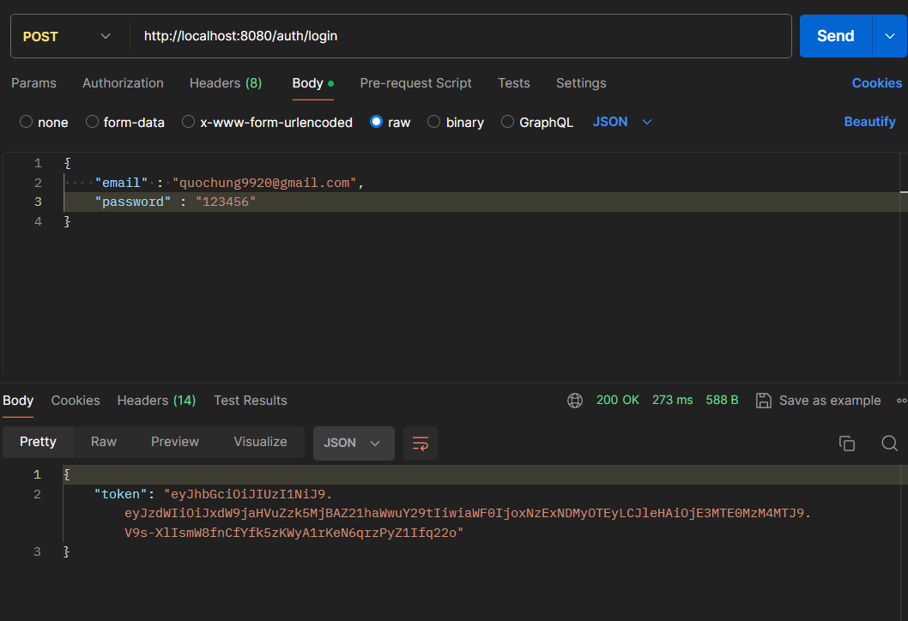

1.2 Đăng ký

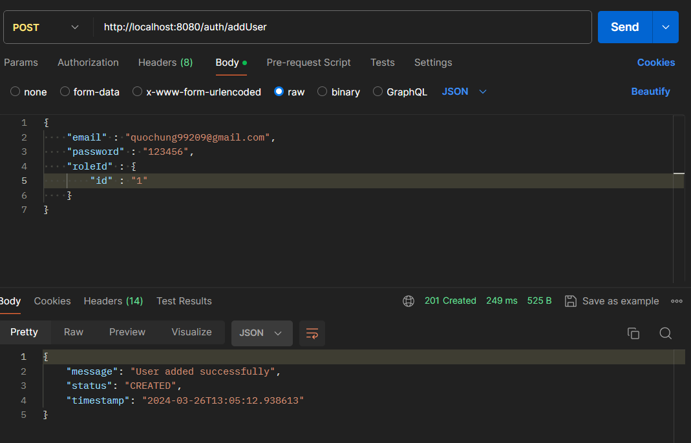

1.3 Quên mật khẩu và đặt lại mật khẩu

Gửi mail xác thực

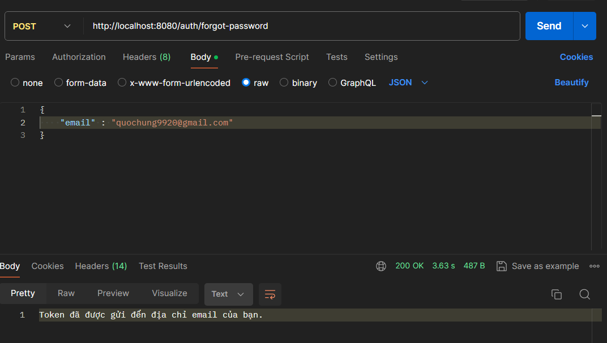

Nhận mail xác thực

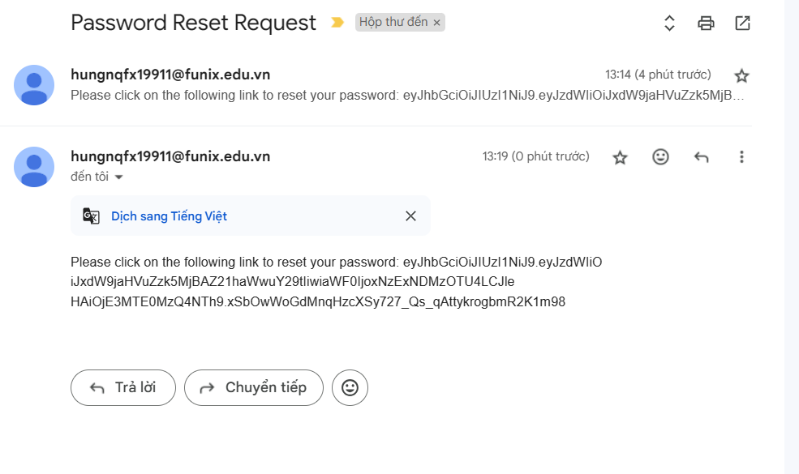

Đặt lại mật khẩu

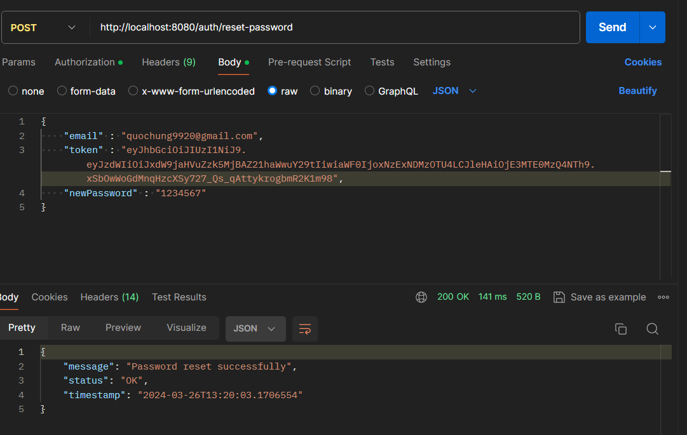

2. Yêu cầu dành cho người dùng

2.1 Hiển thị thông tin của các chuyên khoa nổi bật

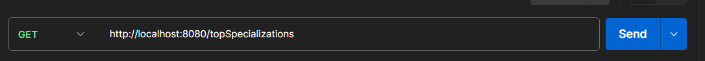

2.2 Hiển thị thông tin của các cơ sở y tế nổi bật

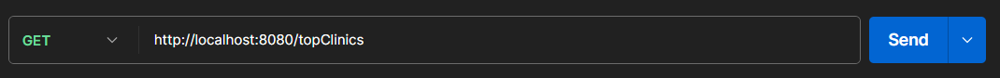

2.3 Hiển thị thông tin cá nhân

Sau khi đăng nhập thành công xong, chúng ta có thể truy cập từ trang chủ để hiển thị ra những thông tin cá nhân của bản thân 

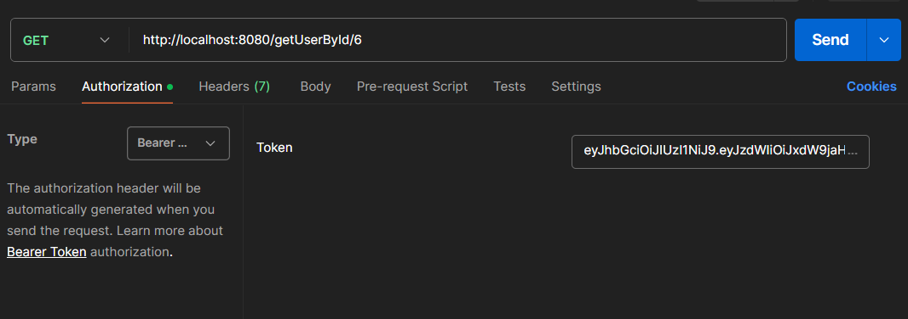

2.4 Tìm kiếm chung

Tìm kiếm theo chuyên khoa

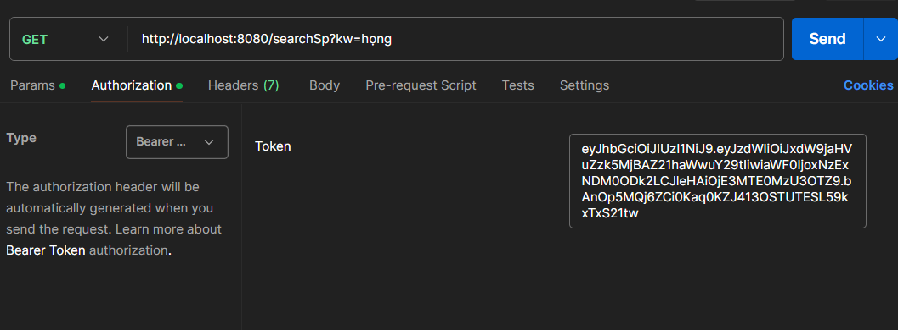

Tìm kiếm theo địa chỉ

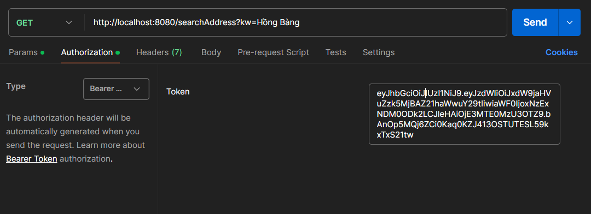

Tìm kiếm theo giá khám bệnh

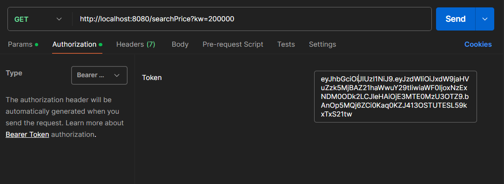

Tìm kiếm theo tên phòng khám

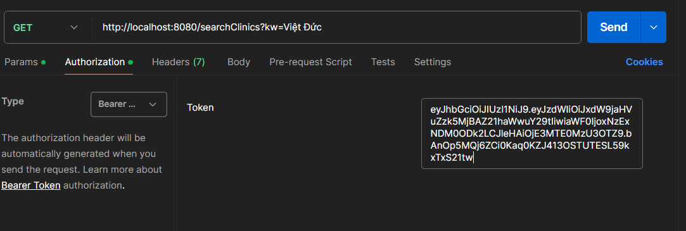

